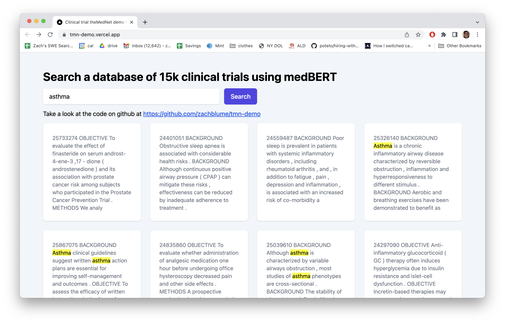

# BERT-based machine learning recommendation engine

Using BERT (a attention-transformer NLP model), specifically medBERT, to generate a embedding-based index in order to match the most similar clinical trails to a string typed into a search box, in real-time (<100ms).

Take a look at:
* [generate-index/main.py](generate-index/main.py) The db index generator and server backend (Python)
* [app/pages/index.js](app/pages/index.js) The frontend (React + NextJS)

App live at [https://tmn-demo.vercel.app/](https://tmn-demo.vercel.app/)

Screenshot:

